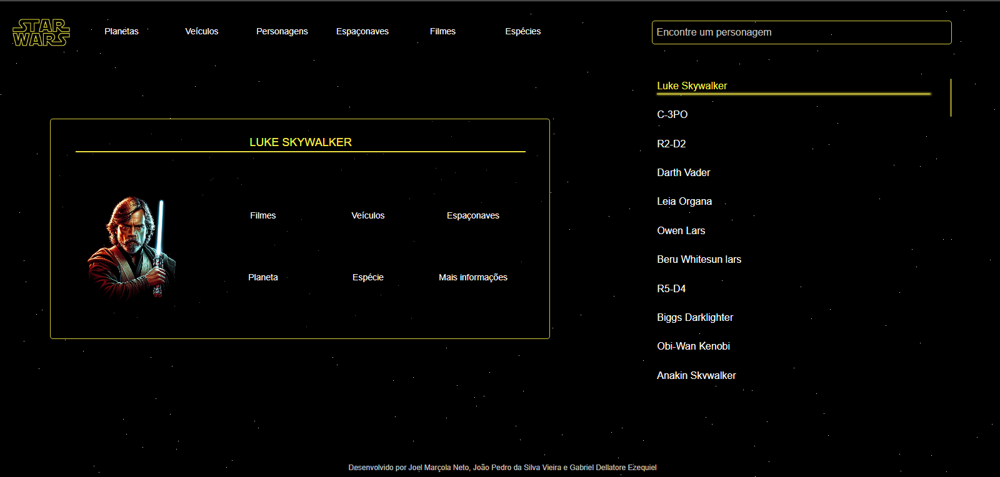
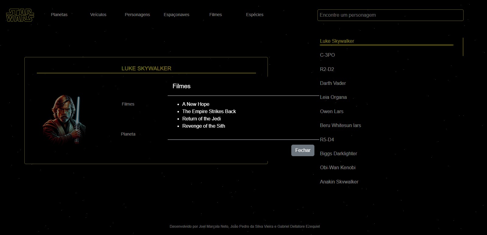

<h1 align="center">
  Star Wars
</h1>

 

  

 

## **Sobre o projeto**

#### Projeto final da disciplina de Desenvolvimento Web II.

Site desenvolvido consumindo dados da <a href="https://swapi.dev/documentation">swapi</a>, que fornece informações a respeito de cada filme, personagem planeta, veículo, espaçonave e espécie encontrados na franquia Star Wars.

 

## **Páginas**

- Planetas
- Veículos
- Personagens
- Espaçonaves
- Filmes
- Espécies

 

## **Demonstração**

A página de personagens traz uma lista com todos os personagens da API, e apresenta um card com as principais informações do personagem selecionado.

 

  

 
 

Os detalhes das informações são mostrados em um modal.

 

  

 

## **Tecnologias utilizadas**

